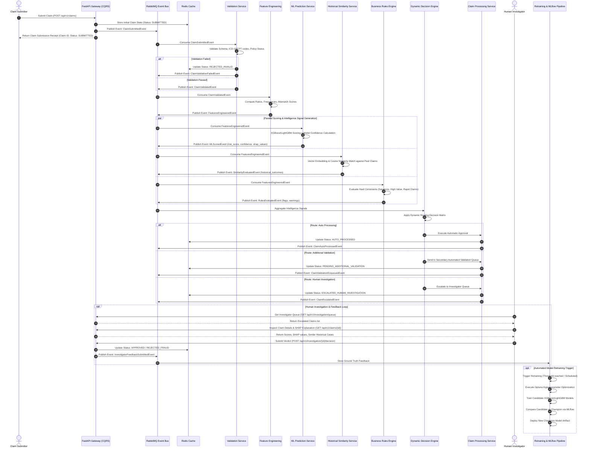

# System Flow & Execution Specification

This document provides a detailed technical specification of the operational workflows, message flows, feature engineering pipelines, decision logic, CQRS commands/queries, and MLOps feedback loops for the **Adaptive Health Insurance Claim Intelligence & Dynamic Routing Platform**.

---

## 📑 Table of Contents

1. [End-to-End System Workflow](#1-end-to-end-system-workflow)
2. [ML Task Framing & Pipeline Architecture](#2-ml-task-framing--pipeline-architecture)
3. [CQRS Command & Query Architecture](#3-cqrs-command--query-architecture)
4. [Multi-Signal Intelligence Pipeline Flow](#4-multi-signal-intelligence-pipeline-flow)
5. [Dynamic Decision Routing Matrix](#5-dynamic-decision-routing-matrix)
6. [Human-in-the-Loop Feedback & Retraining Flow](#6-human-in-the-loop-feedback--retraining-flow)
7. [Observability & Drift Monitoring Flow](#7-observability--drift-monitoring-flow)

---

## 1. End-to-End System Workflow

The sequence diagram below illustrates the complete execution flow from claim ingestion, parallel intelligence scoring, dynamic decision routing, investigator feedback submission, to automated model retraining:



---

## 2. ML Task Framing & Pipeline Architecture

### Machine Learning Problem Definition
- **Problem Classification**: Supervised Calibrated Binary Risk Classification & Uncertainty Estimation.
- **Input Space ($\mathbf{X}$)**: Combined vector of tabular claim data, member 30-day velocity, provider historical flag rates, procedure complexity weights, and diagnosis-procedure consistency scores.
- **Primary Model Target ($Y \in \{0, 1\}$)**: $1 = \text{Anomalous/High-Risk Claim}$, $0 = \text{Clean/Routine Claim}$.
- **Output Signals**:
  1. $\text{Risk Score } p = P(Y=1 \mid \mathbf{X}) \in [0, 1]$
  2. $\text{Confidence Score } c = 1.0 - \text{StdDev}(\text{Tree Predictions}) \in [0, 1]$
  3. $\text{SHAP Values } \mathbf{\phi} \in \mathbb{R}^d$ (Local feature attributions)

---

## 3. CQRS Command & Query Architecture

The platform strictly isolates **State Mutations (Commands)** from **State Reads (Queries)** to maintain high responsiveness and scalability.

### Commands (State Changes)

| Command Name | Payload Summary | Trigger / Purpose |
|---|---|---|
| `SubmitClaimCommand` | `claim_id, member_id, provider_id, diagnosis_code, procedure_code, claim_amount` | User/Provider submits a new claim for processing. |
| `ValidateClaimCommand` | `claim_id, validation_rules` | Triggered by data ingestion to execute structural & domain checks. |
| `ScoreClaimCommand` | `claim_id, feature_vector` | Invokes ML model to generate risk score & confidence metrics. |
| `EvaluateRulesCommand` | `claim_id, features` | Checks business constraint rules. |
| `RouteClaimCommand` | `claim_id, ml_score, confidence, similarity_metrics, rule_flags` | Dynamic decision engine assigns final route path. |
| `ApproveClaimCommand` | `claim_id, approval_type, notes` | Finalizes claim approval (Auto or Human). |
| `RejectClaimCommand` | `claim_id, rejection_reason` | Finalizes claim rejection (Invalid, Rule Violation, Fraud). |
| `EscalateClaimCommand` | `claim_id, escalation_reason` | Escalates claim to investigator review queue. |
| `SubmitFeedbackCommand` | `claim_id, investigator_id, final_verdict, feedback_notes` | Records human verdict as ground truth for MLOps. |

### Queries (Read Models)

| Query Name | Parameters | Return Structure |
|---|---|---|
| `GetClaimStatusQuery` | `claim_id` | Current status, active pipeline stage, timestamp. |
| `GetClaimDetailsQuery` | `claim_id` | Complete claim record, feature values, SHAP explanation, routing history. |
| `GetRiskScoreQuery` | `claim_id` | `ml_risk_score`, `model_confidence`, risk level tier. |
| `GetSimilarClaimsQuery` | `claim_id, top_k` | Top-K nearest historical claims with outcomes (% auto, % flagged, % fraud). |
| `GetInvestigatorQueueQuery` | `status_filter, priority` | List of escalated claims prioritized by risk score & monetary value. |
| `GetMLOpsStatusQuery` | None | Active model version, training metrics (ROC-AUC, F1), Optuna run history. |
| `GetMetricsQuery` | None | Prometheus formatted metrics stream. |

---

## 4. Multi-Signal Intelligence Pipeline Flow

Every claim passes through four distinct intelligence evaluations before a routing decision is rendered:

```text
Incoming Claim
      │
      ├───► 1. Feature Engineering Service
      │        ├── Amount ratio vs diagnosis avg
      │        ├── Provider historical risk rate
      │        ├── Member 30-day submission frequency
      │        └── Diagnosis-Procedure mismatch index
      │
      ├───► 2. ML Prediction Service (XGBoost / LightGBM)
      │        ├── ML Risk Score (0.00 - 1.00 probability)
      │        ├── Model Confidence (Tree variance & margin)
      │        └── SHAP Feature Explanations (Top drivers)
      │
      ├───► 3. Historical Claim Intelligence Service
      │        ├── Feature Vector Embedding
      │        ├── Cosine Similarity search over historical DB
      │        └── Historical Outcome Context (% approved, % fraud)
      │
      └───► 4. Configurable Business Rules Engine
               ├── High-value monetary threshold (> $50,000)
               ├── Provider sanction database check
               ├── Rapid multi-claim submission window (< 24h)
               └── Unassigned out-of-network provider check
```

---

## 5. Dynamic Decision Routing Matrix

The **Dynamic Decision Engine** combines all four intelligence signals using the matrix below:

```text
 ┌────────────────────────────────────────────────────────────────────────────────────────────────────────┐
 │                                      DYNAMIC DECISION MATRIX                                           │
 ├────────────────────────────┬─────────────────────────────┬─────────────────────┬───────────────────────┤
 │ ML Risk Score              │ Model Confidence            │ Business Rules      │ Final Processing Route│
 ├────────────────────────────┼─────────────────────────────┼─────────────────────┼───────────────────────┤
 │ LOW (< 0.25)               │ HIGH (≥ 0.85)               │ All Passed          │ ⚡ AUTO PROCESSING    │
 │ LOW (< 0.25)               │ LOW (< 0.85)                │ All Passed          │ 🔍 ADD. VALIDATION    │
 │ MEDIUM (0.25 - 0.65)       │ ANY                         │ All Passed          │ 🔍 ADD. VALIDATION    │
 │ HIGH (> 0.65)              │ HIGH (≥ 0.80)               │ ANY                 │ 🕵️ INVESTIGATION     │
 │ HIGH (> 0.65)              │ LOW (< 0.80)                │ ANY                 │ 🕵️ INVESTIGATION     │
 │ ANY                        │ ANY                         │ Critical Rule Flag  │ 🕵️ INVESTIGATION     │
 │ ANY                        │ ANY                         │ Historical Fraud    │ 🕵️ INVESTIGATION     │
 └────────────────────────────┴─────────────────────────────┴─────────────────────┴───────────────────────┘
```

---

## 6. Human-in-the-Loop Feedback & Retraining Flow

```text
 ┌──────────────────────┐
 │ Escalated Claim      │
 └──────────┬───────────┘
            │
            ▼
 ┌──────────────────────┐
 │ Human Investigator   │ ◄─── Reviews SHAP Feature Importances, Member History,
 │ Review               │      & Similar Historical Fraud Cases
 └──────────┬───────────┘
            │
            ▼
 ┌──────────────────────┐
 │ Submit Verdict       │ ──► [Approved | Rejected | Confirmed Fraud]
 └──────────┬───────────┘
            │
            ▼
 ┌──────────────────────┐
 │ Feedback Store       │ ──► Ground truth feedback dataset update
 └──────────┬───────────┘
            │
            ▼
 ┌──────────────────────┐
 │ Retraining Pipeline  │
 ├──────────────────────┤
 │ 1. Optuna Hyperparameter Optimization (Max depth, learning rate, regularization)
 │ 2. Train XGBoost/LightGBM Candidate Model
 │ 3. Evaluate Metrics (ROC-AUC, PR-AUC, F1 Score) via MLflow
 │ 4. Compare Candidate vs Current Champion
 │ 5. Register & Deploy New Champion Model if superior
 └──────────────────────┘
```

---

## 7. Observability & Drift Monitoring Flow

```text
                 ┌───────────────────────────────────────────┐
                 │        System & ML Events Stream          │
                 └─────────────────────┬─────────────────────┘
                                       │
                                       ▼
                 ┌───────────────────────────────────────────┐
                 │       Prometheus Metrics Collector        │
                 └─────────────────────┬─────────────────────┘
                                       │
             ┌─────────────────────────┴─────────────────────────┐
             ▼                                                   ▼
┌───────────────────────────┐                       ┌───────────────────────────┐
│     SYSTEM METRICS        │                       │        ML METRICS         │
├───────────────────────────┤                       ├───────────────────────────┤
│ • Claims / sec            │                       │ • Risk Score Distribution │
│ • API Latency (p50/p95/p99)│                      │ • Model Confidence Avg    │
│ • RabbitMQ Queue Depth    │                       │ • Precision, Recall, F1   │
│ • Processing Error Rates  │                       │ • False Positive Rate     │
│ • Route Breakdown (% Auto)│                       │ • PSI Data/Prediction Drift│
└───────────────────────────┘                       └───────────────────────────┘
```